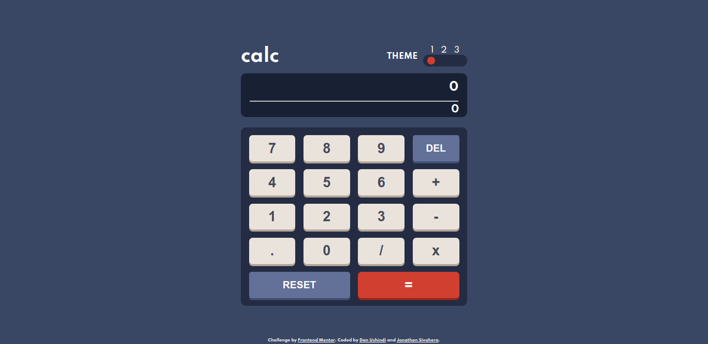

# Frontend Mentor - Calculator app solution

This is a solution to the [Calculator app challenge on Frontend Mentor](https://www.frontendmentor.io/challenges/calculator-app-9lteq5N29). Frontend Mentor challenges help you improve your coding skills by building realistic projects

## Table of contents

- [Overview](#overview)
  - [The challenge](#the-challenge)
  - [Screenshot](#screenshot)
  - [Links](#links)
- [My process](#my-process)
  - [Built with](#built-with)
- [Author](#author)
- [Acknowledgments](#acknowledgments)

## Overview

### The challenge

Users should be able to:

- See the size of the elements adjust based on their device's screen size.
- Perform mathmatical operations like addition, subtraction, multiplication, and division
- Adjust the color theme based on their preference
- **Bonus**: Have their initial theme preference checked using `prefers-color-scheme` and have any additional changes saved in the browser

### Screenshot

### Links

- Solution URL: [https://github.com/DanUshindi/calculator/](https://github.com/DanUshindi/calculator/)
- Live Site URL: [https://danushindi.github.io/calculator/](https://danushindi.github.io/calculator/)

## My process

### Built with

- Semantic HTML5 markup
- CSS custom properties
- CSS Grid and Flexbox
- Mobile-first workflow

## Author

- Frontend Mentor - [@DanUshindi](https://www.frontendmentor.io/profile/DanUshindi)
- Twitter - [@dan_ushindi](https://www.twitter.com/dan_ushindi)

## Acknowledgments

I have worked on this project with a genius.
His name is Jonathan
Here are his social links:

- Frontend Mentor - [@jsivahera](https://www.frontendmentor.io/profile/jsivahera)
- Twitter - [@jsivahera] (https://www.twitter.com/jsivahera)
